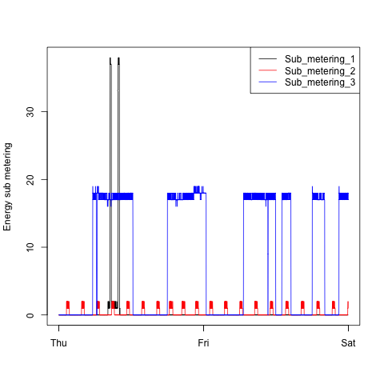

This README is intended to help peer reviewers. For the original README, see [https://github.com/rdpeng/ExData_Plotting1](https://github.com/rdpeng/ExData_Plotting1/blob/master/README.md).

Note that the reference images are slightly larger than the 480x480 format required by the assignment.

### Plot1

 [my submission](plot1.R) | rdpeng's reference |
|:-------------:|:------:|
|   |  |

### Plot2

| [my submission](plot2.R) | rdpeng's reference |
|:-------------:|:------:|
|   |  |

### Plot3

| [my submission](plot3.R) | rdpeng's reference |
|:-------------:|:------:|
|   |  |

### Plot4

| [my submission](plot4.R) | rdpeng's reference |
|:-------------:|:------:|
|   |  |

